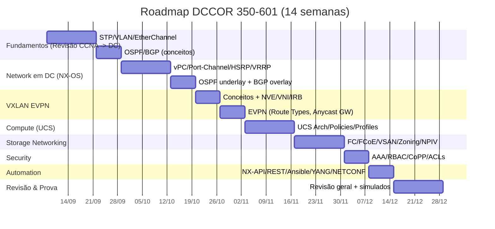
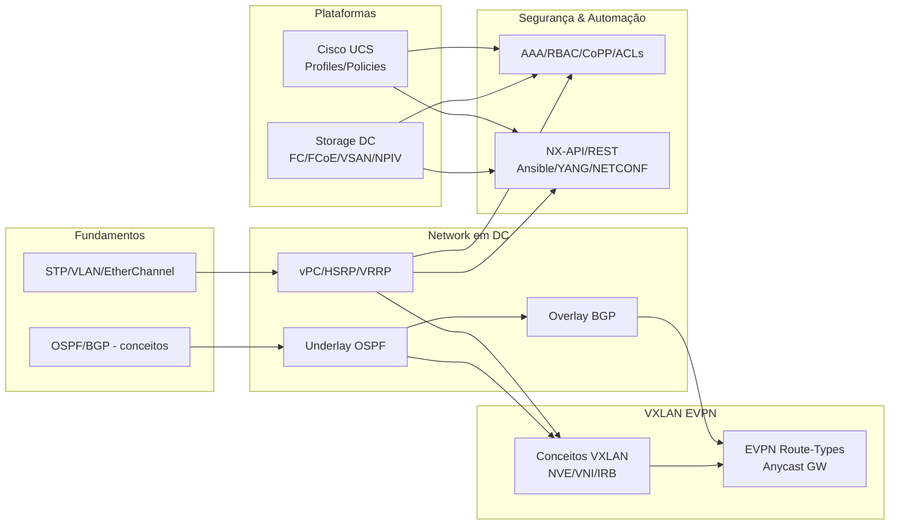

# Roadmap — CCNP DCCOR 350-601 (14 semanas)

## Visão geral (Gantt)

> Legenda: **S%W** na régua = Semana (S01 = semana 1, etc.). Ajuste as semanas conforme o teu início real.

---

## Dependências (mapa)

---

## Checklist de estudo
- [ ] **Fundamentos**: STP, VLAN, EtherChannel, OSPF/BGP (conceitos).  
- [ ] **Network DC**: vPC, HSRP/VRRP, OSPF underlay, BGP overlay.  
- [ ] **VXLAN EVPN**: NVE, VNI, IRB, Route Types (2/5), Anycast Gateway.  
- [ ] **UCS**: Service Profiles, Templates, Policies (BIOS/Boot/vNIC/vHBA).  
- [ ] **Storage**: FC, FCoE, VSAN, Zoning, NPIV, multipathing.  
- [ ] **Security**: AAA/TACACS+, RBAC, CoPP, ACLs.  
- [ ] **Automation**: NX-API/REST, Ansible (NX-OS/UCS), YANG/NETCONF (conceitos).  
- [ ] **Simulados & Errata**: 2 simulados completos + revisão dos erros.
- [ ] Teste